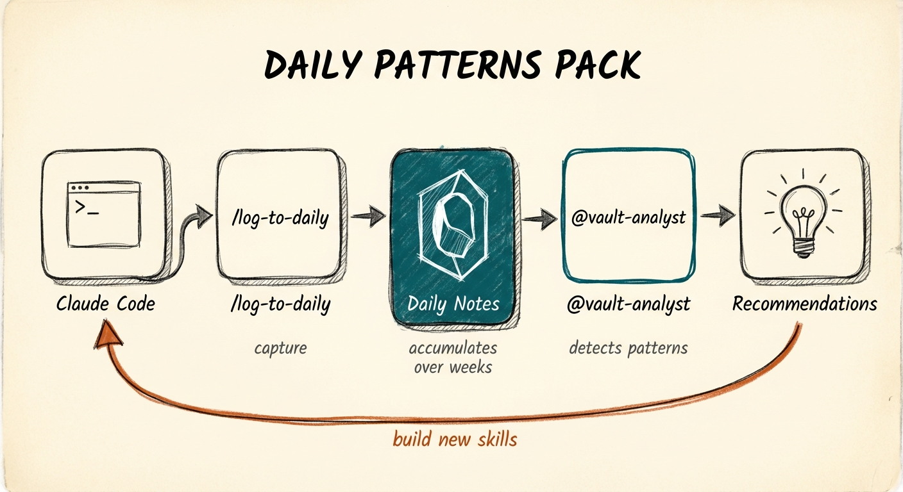

# Daily Patterns Pack

[](https://opensource.org/licenses/MIT)
[](https://claude.ai/claude-code)
[](https://obsidian.md)



**Turn your daily notes into a system that learns you.**

A two-tool feedback loop: capture what you do, discover what you should automate.

## The Problem

You use Claude Code. You get things done. But then:

- Tomorrow, you forget what you decided today
- You repeat the same manual workflows weekly
- You never notice which tasks drain your time
- You can't see your own work patterns

Claude doesn't remember between sessions. Your daily notes do—but only if you write to them, and only if something reads them back.

## The Solution

Two tools. One feedback loop.

### `/log-to-daily` — Capture

At the end of each session, run `/log-to-daily`. Claude analyzes your conversation and appends a structured log to today's daily note:

```markdown
## Session Log - 2:45 PM

**Focus:** Local LLM integration for cost optimization

### Completed
- Overhauled inbox-processor with local_classify
- Created keep-warm launchd agent for Ollama
- Tested classification accuracy (~66%)

### Decisions Made
| Decision | Rationale |
|----------|-----------|
| Hybrid local/cloud pattern | Local does mechanical work, Claude does judgment |
| 4-minute keep-warm interval | Prevents cold start without wasting resources |

### Files Modified
- [[inbox-processor]] - Added local LLM integration

### Next Steps
- [ ] Monitor token savings over next week
```

**What gets captured:**
- Concrete outcomes (not just "worked on stuff")
- Decisions with rationale
- Files created/modified (with wiki links)
- Follow-up tasks

### `@vault-analyst` — Discover

After a few weeks of logs, run `@vault-analyst`. It reads your daily notes and surfaces:

- **Recurring tasks** you do manually every week
- **Time patterns** (when you do deep work vs admin)
- **Friction points** (what blocks you repeatedly)
- **Automation candidates** (specific skills/agents to build)

```markdown
## Vault Analysis Report

**Analyzed:** 30 daily notes (Jan 1 - Jan 30)

### Automation Recommendations

**1. weekly-financial-sync** — Priority: High
- **Why:** "Sync MoneyWiz" appears in 4 of 4 Friday notes
- **What it would do:** Auto-pull transactions, categorize, update Notion
- **Time saved:** ~30 min/week
- **Effort to build:** Medium

**2. newsletter-preflight** — Priority: High
- **Why:** 6 session logs mention "check slop", "verify links", "SEO meta"
- **What it would do:** Run all pre-publish checks in sequence
- **Time saved:** ~15 min/issue
- **Effort to build:** Low (compose existing skills)
```

## The Compounding Effect

Week 1: You log sessions. Nothing special yet.

Week 4: Vault-analyst spots your Friday financial review pattern. You build a skill.

Week 8: That skill appears in your logs. Vault-analyst notices you always run it *after* checking email. Suggests an agent that coordinates both.

Week 12: Your system now handles things you used to do manually. Your logs shift to higher-level work. Vault-analyst notices *that* pattern too.

**The more you log, the more patterns emerge. The more patterns, the better your automation. The better your automation, the more valuable work you log.**

## Requirements

- **Daily notes in Obsidian** — Format: `00 Daily/YYYY/YYYYMMDD.md` (configurable)
- **Claude Code** — These are Claude Code skills/agents
- **Consistency** — The system learns from repetition. Sporadic logging = weak patterns.

## Installation

```bash
# Clone the pack
git clone https://github.com/aplaceforallmystuff/daily-patterns-pack.git
cd daily-patterns-pack

# Run the installer
./install.sh

# Or manually copy
cp -r skills/log-to-daily ~/.claude/skills/
cp agents/vault-analyst.md ~/.claude/agents/
```

## Configuration

Edit the daily note path in `log-to-daily/SKILL.md`:

```markdown
<daily_note_location>
Path: `00 Daily/YYYY/YYYYMMDD.md`
</daily_note_location>
```

Adjust to match your vault structure.

## Usage

### Daily Logging

```
# End of session
/log-to-daily

# After significant work
/log-to-daily

# When you made an important decision
/log-to-daily
```

### Pattern Analysis

```
# After 2+ weeks of logs
@vault-analyst analyze my vault

# Focused analysis
@vault-analyst what should I automate?

# Time patterns
@vault-analyst what are my productivity patterns?
```

## What Makes Good Logs

**Specific outcomes:**
- ✅ "Created inbox-processor with local_classify integration"
- ❌ "Worked on inbox stuff"

**Decisions with reasoning:**
- ✅ "Chose hybrid local/cloud pattern because local model accuracy was only 66%"
- ❌ "Made some decisions about the approach"

**Linked files:**
- ✅ "Modified [[inbox-processor]] and [[vault-analyst]]"
- ❌ "Changed some files"

The quality of your logs determines the quality of vault-analyst's recommendations.

## The Philosophy

Most AI tools optimize for single sessions. This pack optimizes for *months*.

Your daily notes become training data—not for an AI model, but for your personal automation system. Every session logged is a data point. Every pattern detected is an automation waiting to be built.

**You're not just using Claude. You're teaching your vault to work like you do.**

---

## Files Included

```
daily-patterns-pack/
├── agents/
│   └── vault-analyst.md
├── skills/
│   └── log-to-daily/
│       └── SKILL.md
├── install.sh
├── LICENSE
└── README.md
```

## License

MIT — Use freely, build on it, make it yours.

---

*Part of the Cerebro plugin ecosystem. Start small, compound over time.*
